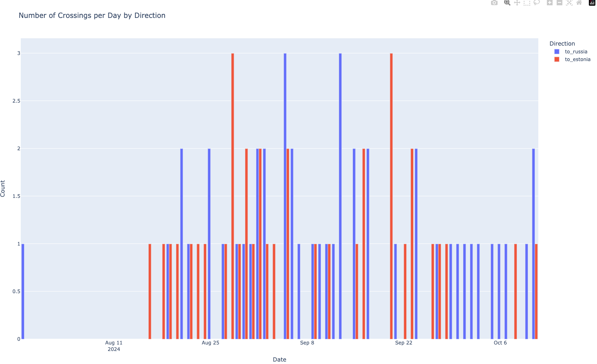
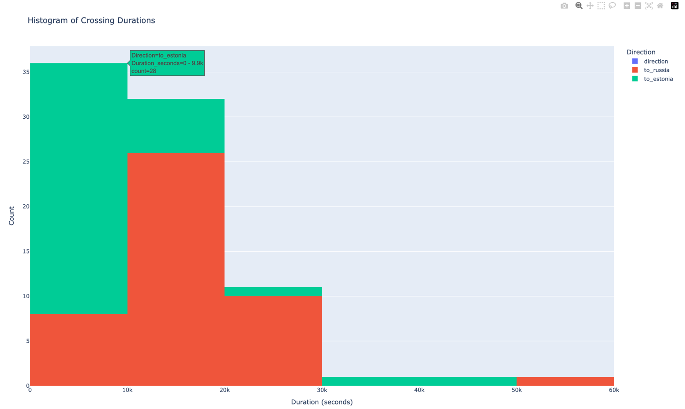

# Narva Stats project
This project analyses time of border crossing reported in [telegram chat](https://t.me/Transfer_SPB_Estonia1)

## (Abstract) Pipline for collecting clean data points:
- Collecting all messages from search results in telegram by "отчет" and "#отчет"
- Save them to CSV file.
- Iterate over the messages csv file and parse into pydantic object with GPT.
- Extract time of arriving to the border, how long they waited in the queue and which checkpoint and when it was crossed.
- Save that data to a CSV for further statistical analysis

## Results
N population size of messages = 352 
N population size of detected and parsed reports = 91

